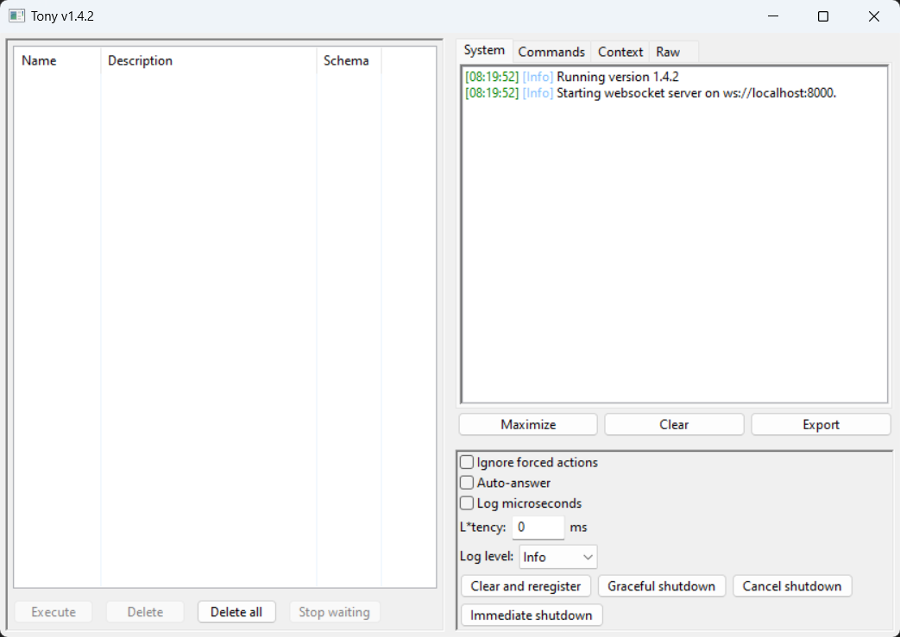
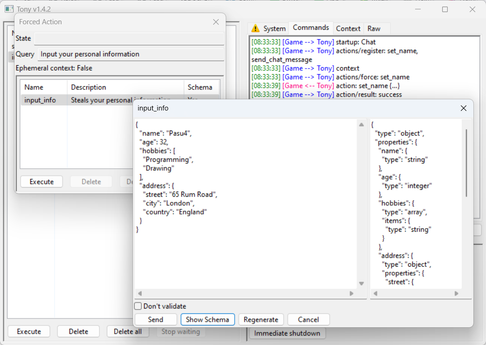

# Tony

Tony is a graphical implementation of the [Neuro API](https://github.com/VedalAI/neuro-game-sdk) in python.
Like [Randy](https://github.com/VedalAI/neuro-game-sdk/blob/main/Randy), he can answer `actions/force` commands automatically, but also allows the user to formulate the response Neuro would send themselves, as well as send non-forced actions whenever.

> [!Note]
> I cannot guarantee that this implementation perfectly emulates what Neuro could/would do, or that it is error-free.
> There might be some things that I have overlooked.

## Installation

A Python version of 3.10 or higher is required.
Python versions 3.9 and below will not work.

The program can be installed from GitHub or from PyPI.
If you want to modify the project and/or contribute, use the GitHub method.

<!-- #region Windows -->

<details>

<summary>Windows</summary>

### Windows

#### From PyPI

This will install the package from PyPI using pip.

1. Run `pip install neuro-api-tony`

#### From GitHub

This will install the package in a virtual environment to not conflict with any global packages.
Skip steps 2 and 3 if you don't want a virtual environment.
**All commands after step 1 should be run in the downloaded folder.**

1. Clone the repository with `git clone https://github.com/Pasu4/neuro-api-tony.git` or download it from GitHub
2. Run `python -m venv .venv`
3. Run `.\.venv\Scripts\activate`
4. Run `pip install -e .`

</details>

<!-- #endregion -->

<!-- #region MacOS -->

<details>

<summary>MacOS</summary>

### MacOS

**Warning: This has not been tested, as I don't own a Mac.**

#### From PyPI

This will install the package from PyPI using pip.

1. Run `pip install neuro-api-tony`

#### From GitHub

This will install the package in a virtual environment to not conflict with any global packages.
Skip steps 2 and 3 if you don't want a virtual environment.
**All commands after step 1 should be run in the downloaded folder.**

1. Clone the repository with `git clone https://github.com/Pasu4/neuro-api-tony.git` or download it from GitHub
2. Run `python -m venv .venv`
3. Run `source ./.venv/bin/activate`
4. Run `pip install -e .`

</details>

<!-- #endregion -->

<!-- #region Fedora -->

<details>

<summary>Fedora</summary>

### Fedora

#### From PyPI

This will install the package from PyPI using pip.

1. Run `sudo dnf install g++ gtk3-devel python-config`
2. Run `pip install neuro-api-tony`

#### From GitHub

This will install the package in a virtual environment to not conflict with any global packages.
Skip steps 2 and 3 if you don't want a virtual environment.
**All commands after step 2 should be run in the downloaded folder.**

1. Run `sudo dnf install g++ gtk3-devel python-config`
2. Clone the repository with `git clone https://github.com/Pasu4/neuro-api-tony.git` or download it from GitHub
3. Run `python -m venv .venv`
4. Run `source ./.venv/bin/activate`
5. Run `pip install -e .`

Tested on Fedora 41 with Python 3.13.1.

</details>

<!-- #endregion -->

<!-- #region Linux -->

<details>

<summary>Other Linux distributions</summary>

### Other Linux distributions

Warning:
Not all Linux distributions have been tested.
You might have to install GTK+ in some form.
On ubuntu-based systems, look for `libgtk-3-dev`.
Also see https://github.com/wxWidgets/Phoenix/blob/wxPython-4.2.2/README.rst#prerequisites.
If you run into further problems with a specific distribution, please [submit an issue](https://github.com/Pasu4/neuro-api-tony/issues).

#### From PyPI

This will install the package from PyPI using pip.

1. Run `pip install neuro-api-tony`

#### From GitHub

This will install the package in a virtual environment to not conflict with any global packages.
Skip steps 2 and 3 if you don't want a virtual environment.
**All commands after step 1 should be run in the downloaded folder.**

1. Clone the repository with `git clone https://github.com/Pasu4/neuro-api-tony.git` or download it from GitHub
2. Run `python -m venv .venv`
3. Run `source ./.venv/bin/activate`
4. Run `pip install -e .`

</details>

<!-- #endregion -->

## Updating

> [!Note]
> This repository was renamed from `neuro-api-human-control` to `neuro-api-tony`.
> GitHub should automatically redirect requests to the new URL, but in case you run into problems because of this, run `git remote set-url origin https://github.com/Pasu4/neuro-api-tony.git` in the repository.

If you have installed Tony by cloning the repository, pull the latest changes using git.
If you downloaded from GitHub without cloning it, you're better off re-downloading and re-installing than updating the files manually.
**All commands should be run in the root folder of the repository.**

1. Run `git pull`
2. Run `.\.venv\Scripts\activate` on Windows, or `source ./.venv/bin/activate` on Linux / Mac (Skip this step if you didn't set up a virtual environment)
3. Run `pip install -e .` to install any potential new dependencies

If you installed Tony from PyPI, you can update using `pip install --upgrade neuro-api-tony`.

## Usage

This assumes you have set up a virtual environment during installation.
Skip step 1 if you haven't, or if your virtual environment is already activated.

1. In the folder of the application, run `.\.venv\Scripts\activate` on Windows, or `source ./.venv/bin/activate` on Linux / Mac
2. Run `neuro-api-tony`

The application window should now open.
The left panel will display the actions once they have been registered.
They can be executed by clicking the "execute" below the list.
The right panel shows an event log, below that is a smaller panel with some controls.
After sending an `action` command to the game, the next action can only be sent after the `action/result` command has been received.
When the game sends an `actions/force` command, a window will open that only shows the applicable actions, and will only close once the `action/result` command indicates success.

By default, Tony opens a websocket server on port `8000` (websocket URL `ws://localhost:8000`), this can be changed with command line arguments.

> [!Note]
> When working with the Unity SDK, you need to focus the Unity editor after sending an action for the game to receive the action.

### Command line arguments

Copy-pasted from the help message:

```
-h, --help:
    Show this help message and exit.

-a, --addr, --address <ADDRESS>:
    The address to start the websocket server on. Default is localhost.

-l, --log, --log-level <LOG_LEVEL>:
    The log level to use. Default is INFO. Must be one of: DEBUG, INFO,
    WARNING, ERROR, SYSTEM.

-p, --port <PORT>:
    The port number to start the websocket server on. Default is 8000.

-v, --version:
    Show the version of the program and exit.
```

### Actions panel

To execute an action, the game first needs to send an `actions/register` command.
After that, an entry should appear in the left panel showing the name of the action and its description.

There are some buttons at the bottom of the panel:

- **Execute:** Opens a window where you can enter the content of the reply and send it via the "Send" button. The window will already contain some sample JSON that validates against the schema. By default, your input will be parsed and validated against the schema before sending, you can turn this off in the control panel.
- **Delete:** Manually unregisters the selected action. This is not something Neuro would normally do.
- **Unlock:** Unlocks the execute button while waiting for an `action/result` command. This is probably not something Neuro would normally do.

### Forced actions

If an `actions/force` command is received, a "Forced action" window will open, showing all applicable actions and the query and state of the command.
Executing actions from here works the same as from the main actions panel.
Once the action has been sent, the window will close automatically.
You can also close the window manually, this will ignore the forced action and allow you to execute any registered action.

### Logs

The log panel on the top right has three different tabs:

- The **log tab** logs all commands that are received and sent, without showing their content. It also shows messages with color-coded tags:
    - **Debug (gray):** Things that usually should be handled internally by an SDK (e.g. action IDs), as well as some internals of the application. Debug messages alone are not a cause for concern.
    - **Info (blue):** Things that will likely not cause problems with Neuro, but might point to some other issue (e.g. `action/result` with no message).
    - **Warning (yellow):** Things that do not comply with the API specification, but which Tony can still tolerate (e.g. trying to register actions before sending `startup`). These will likely cause problems with Neuro.
    - **Error (red):** Things that make it impossible to process a command (e.g. receiving invalid JSON). These will definitely cause problems with Neuro.
    - **Critical (dark red):** Something went wrong and it is not your fault. If you see such a message, please [submit a bug report](https://github.com/Pasu4/neuro-api-tony/issues).
- The **context tab** shows everything that Neuro would get to read directly, which is the content of `context` commands, the description of actions, the state and query of `actions/force` commands, and the message of `action/result` commands. Silent contexts are diplayed in gray and ephemeral contexts in light blue. It has the following tags:
    - **Context:** Message is from a `context` command.
    - **Silent:** Message is from a silent `context` command.
    - **State:** Message is the state of an `actions/force` command.
    - **Query:** Message is the query of an `actions/force` command.
    - **Ephemeral:** Message is the query or state of an `actions/force` command with ephemeral context.
    - **Action:** Message is the description of an action, logged at registration.
    - **Result:** Message is from an `action/result` command. The color denotes whether the result indicates success (green) or failure (red).
- The **raw tab** shows the full data sent over the websocket, as well as who sent that data. If it is valid JSON, it will be formatted for easier viewing.

### Control panel

#### Normal controls

The control panel has some checkboxes and buttons that change the behavior of the application.

- **Validate JSON schema:** If checked, will not allow you to send a message that does not validate against the schema.
- **Ignore forced actions:** If checked, will not open the "Forced action" dialog when an `actions/force` command is received. You have to execute the action yourself from the left panel. Since the forced action is ignored, you can execute any registered action.
- **Automatically answer forced actions**: If checked, will immediately send the pre-generated JSON of a random valid action instead of opening the "Forced action" window when an `actions/force` command arrives. This behavior is similar to what Randy does.
- **L\*tency:** Will delay sending commands by the specified time. Must be non-negative and not greater than 10000ms.
- **Log level:** Will show only messages with an equal of higher log level than the selection. For example, selecting "Warning" will not show Debug or Info messages, but still show Warning, Error and System messages.

#### Experimental controls

These controls are [proposed features](https://github.com/VedalAI/neuro-game-sdk/blob/main/API/PROPOSALS.md) in the Neuro API that will likely not work unless specifically implemented. Use at your own risk!

- **Clear all actions and request reregistration (experimental):** Will unregister all currently registered actions and send an [`actions/reregister_all`](https://github.com/VedalAI/neuro-game-sdk/blob/main/API/PROPOSALS.md#reregister-all-actions) command to the game.
- **Request graceful shutdown (experimental):** Will send a [`shutdown/graceful`](https://github.com/VedalAI/neuro-game-sdk/blob/main/API/PROPOSALS.md#graceful-shutdown) command to the game, indicating it should save the game and return to the main menu at the next opportunity.
- **Cancel graceful shutdown (experimental):** Will send a [`shutdown/graceful`](https://github.com/VedalAI/neuro-game-sdk/blob/main/API/PROPOSALS.md#graceful-shutdown) command with its `wants_shutdown` field set to `false` to the game, indicating to cancel a previous shutdown request.
- **Request immediate shutdown (experimental):** Will send a [`shutdown/immediate`](https://github.com/VedalAI/neuro-game-sdk/blob/main/API/PROPOSALS.md#immediate-shutdown) command to the game, indication that the game *will* (not *should*!) be shut down within the next few seconds.

## Screenshots




